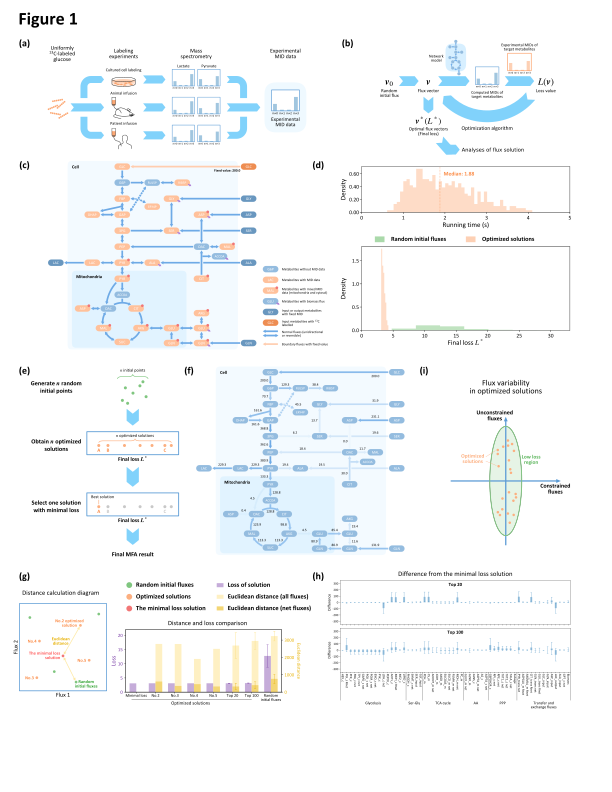

# Scientific Figure Plotting
This package is designed for creating high-quality vector graphs, scientific diagrams, and data figures with consistency and precision. It allows for seamless integration of complex data into visually cohesive and informative diagrams.

### Get started

To quickly get started, we’ve provided an example that includes all necessary elements. You can generate the sample figure using the following command:

```shell
python main.py figure 1
```

The example output is:


### Arguments

**Positional arguments**

`figure_name`: Target figure name to generate.

**Optional arguments**

`-s, --svg`: Output SVG figures. Default output is PDF format.

`-b, --background`: Add background when output SVG figures.


| Arguments | Figures  | Output files                                                 |
|-----------|----------|--------------------------------------------------------------|
| `1`       | Figure 1 | [`figure_1.pdf`](example_figures/output_figure/figure_1.pdf) |

## Contributors

**Shiyu Liu**

+ [http://github.com/liushiyu1994](http://github.com/liushiyu1994)

## License

This software is released under the [MIT License](LICENSE).

